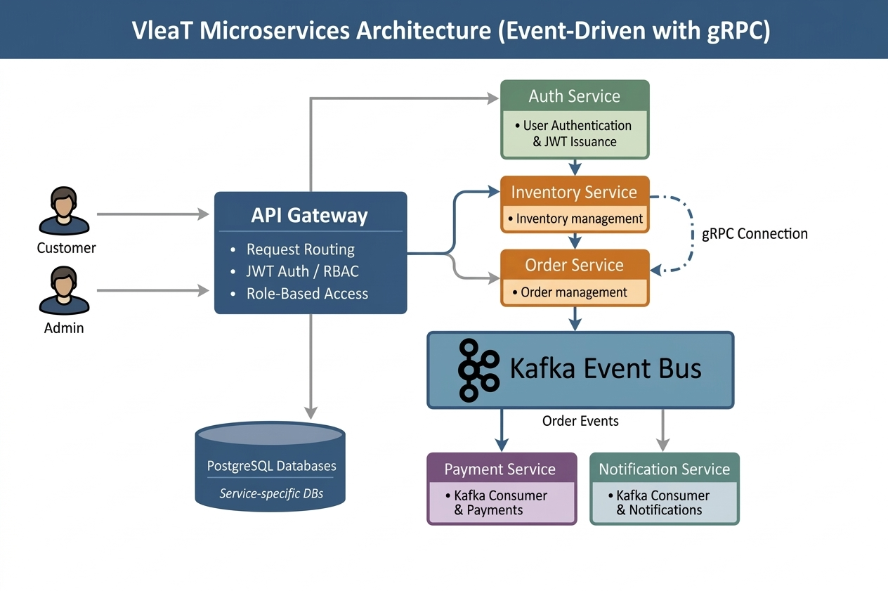

# VIeaT Microservices Platform


A production-style Spring Boot microservices project for a food ordering platform, built with secure API Gateway routing, JWT authentication, role-based authorization, Kafka-based event-driven communication, PostgreSQL persistence, and Docker Compose orchestration.

---

## Project Overview

VIeaT is a distributed microservices backend system designed to demonstrate a modern backend architecture using Spring Boot.

The system is organized around independent services, each with a clear responsibility, while the **API Gateway** acts as the only public entry point for clients.

### Core goals of the project
- secure microservices communication through a single API Gateway
- JWT-based authentication and authorization
- role-based access control with `ADMIN` and `CUSTOMER`
- ownership-based resource protection for customer data
- event-driven processing using Kafka
- separate PostgreSQL databases per service
- fully containerized local setup using Docker Compose

---

## Architecture Summary

The platform follows a microservices architecture with both synchronous and asynchronous communication patterns.

### Main components
- **api-gateway** — single public entry point
- **auth-service** — authentication and JWT generation
- **customer-service** — customer profile management
- **inventory-service** — inventory and item management
- **order-service** — order creation and orchestration
- **payment-service** — payment record processing
- **notification-service** — notification record processing
- **PostgreSQL** — separate databases for services
- **Kafka** — asynchronous event communication

### High-level behavior
- Clients communicate only with the **API Gateway**
- The gateway routes requests to internal services
- `auth-service` issues JWT tokens after login
- Gateway validates JWT tokens on protected routes
- `order-service` publishes `order-placed` events to Kafka
- `payment-service` and `notification-service` consume those events
- Each service stores its own data in PostgreSQL

---

### Architecture Diagram

The system follows a **gateway-routed microservices architecture** with independent HTTP services, event-driven processing using Kafka, and gRPC-based inventory validation during order placement.

- All client requests go through the **API Gateway**
- Services are independently accessible via the gateway
- **Order processing is asynchronous** using Kafka
- **Payment and Notification services consume events** instead of being tightly coupled
- **Communication between Inventory service done via gRPC** from Order Service



### Authentication Flow
1. Client sends login request through API Gateway
2. Gateway forwards the request to `auth-service`
3. `auth-service` validates credentials
4. JWT token is generated and returned to the client
5. Client includes the token in future protected requests

### Protected Request Flow
1. Client sends request with `Authorization: Bearer <token>`
2. API Gateway validates JWT
3. Gateway checks route-level access rules
4. Request is routed to the target microservice
5. Downstream service may enforce ownership checks

### Order Processing Flow
1. Client creates an order through `api-gateway`
2. Request is routed to `order-service`
3. `order-service` may communicate with `inventory-service`
4. Order is persisted
5. `order-service` publishes `order-placed` event to Kafka
6. `payment-service` consumes the event and creates a payment record
7. `notification-service` consumes the event and creates a notification record

---

## Microservices

### 1. API Gateway
**Responsibility**
- single public entry point
- request routing
- JWT validation
- route-level authorization

**Communication**
- synchronous HTTP

**Important Notes**
- clients should access the system only through the gateway
- internal microservice ports should not be treated as public APIs

---

### 2. Auth Service
**Responsibility**
- user registration
- login
- JWT generation

**Main Endpoints**
- `POST /api/auth/register`
- `POST /api/auth/login`

**Communication**
- synchronous HTTP

**Database Usage**
- stores authentication/user credential-related data

**Important Notes**
- this service is the source of JWT token generation
- gateway uses the token for protecting downstream services

---

### 3. Customer Service
**Responsibility**
- customer profile management
- customer data retrieval and updates

**Main Endpoints**
- `GET /api/customers/{id}`
- `PUT /api/customers/{id}`
- `GET /api/customers` *(ADMIN)*

**Communication**
- synchronous HTTP

**Database Usage**
- dedicated customer database

**Important Notes**
- `CUSTOMER` should only access their own profile
- `ADMIN` can access all customer profiles

---

### 4. Inventory Service
**Responsibility**
- item and inventory management
- stock availability operations

**Main Endpoints**
- `GET /api/inventory`
- `GET /api/inventory/{id}`
- `POST /api/inventory`
- `PUT /api/inventory/{id}`

**Communication**
- synchronous HTTP

**Database Usage**
- dedicated inventory database

**Important Notes**
- can be used internally by `order-service`
- administrative inventory operations should be restricted

---

### 5. Order Service
**Responsibility**
- order creation
- order retrieval
- business flow coordination
- Kafka event publishing

**Main Endpoints**
- `POST /api/orders`
- `GET /api/orders/{id}`
- `GET /api/orders/customer/{customerId}`
- `GET /api/orders` *(ADMIN)*

**Communication**
- synchronous HTTP
- asynchronous Kafka producer

**Database Usage**
- dedicated order database

**Important Notes**
- publishes `order-placed` Kafka events
- may call `inventory-service`
- `CUSTOMER` should access only their own orders

---

### 6. Payment Service
**Responsibility**
- consumes order events
- creates and stores payment records
- exposes payment lookup APIs

**Main Endpoints**
- `GET /api/payments`
- `GET /api/payments/{id}`
- `GET /api/payments/order/{orderId}`

**Communication**
- Kafka consumer
- synchronous HTTP for reads

**Database Usage**
- dedicated payment database

**Important Notes**
- triggered asynchronously by Kafka
- `CUSTOMER` should access only their own payment records

---

### 7. Notification Service
**Responsibility**
- consumes order events
- creates and stores notification records
- exposes notification lookup APIs

**Main Endpoints**
- `GET /api/notifications`
- `GET /api/notifications/{id}`
- `GET /api/notifications/order/{orderId}`

**Communication**
- Kafka consumer
- synchronous HTTP for reads

**Database Usage**
- dedicated notification database

**Important Notes**
- triggered asynchronously by Kafka
- `CUSTOMER` should access only their own notification records

---

## Security

Security is one of the main highlights of this project.

### Authentication
- users authenticate through `auth-service`
- successful login returns a JWT token
- the token must be included in protected requests

### Authorization Model
Two roles are supported:

- `ADMIN`
- `CUSTOMER`

### Access Rules
#### ADMIN
- full access to all services and resources

#### CUSTOMER
- can access only:
  - their own customer profile
  - their own orders
  - their own payments
  - their own notifications

### Enforcement Design
- **Gateway** handles JWT validation and route-level protection
- **Downstream services** enforce ownership checks where needed

---

## API Gateway Routing

The gateway is the single external access point for the platform.

### Example routes
- `/api/auth/**` → `auth-service`
- `/api/customers/**` → `customer-service`
- `/api/inventory/**` → `inventory-service`
- `/api/orders/**` → `order-service`
- `/api/payments/**` → `payment-service`
- `/api/notifications/**` → `notification-service`

### Why API Gateway is important here
- hides internal service topology
- centralizes authentication
- centralizes authorization rules
- avoids exposing every microservice directly to clients

---

## Event-Driven Communication

Kafka is used to decouple order creation from downstream side effects.

### Topic
- `order-placed`

### Producer
- `order-service`

### Consumers
- `payment-service`
- `notification-service`

### Benefit
This makes the design more modular and closer to real-world microservices architecture, where side effects such as payment initialization and notification generation are processed asynchronously.

---

## Databases

PostgreSQL is used as the persistent data store.

### Database Strategy
Each service owns its own data and database boundary.

Example logical databases:
- `authdb`
- `customerdb`
- `inventorydb`
- `orderdb`
- `paymentdb`
- `notificationdb`

This improves service independence and reduces tight coupling.

---

## Docker Setup

The complete platform is designed to run through Docker Compose.

### Services expected in Docker Compose
- api-gateway
- auth-service
- customer-service
- inventory-service
- order-service
- payment-service
- notification-service
- postgres
- kafka

### Start the full stack
```bash
docker compose up --build
